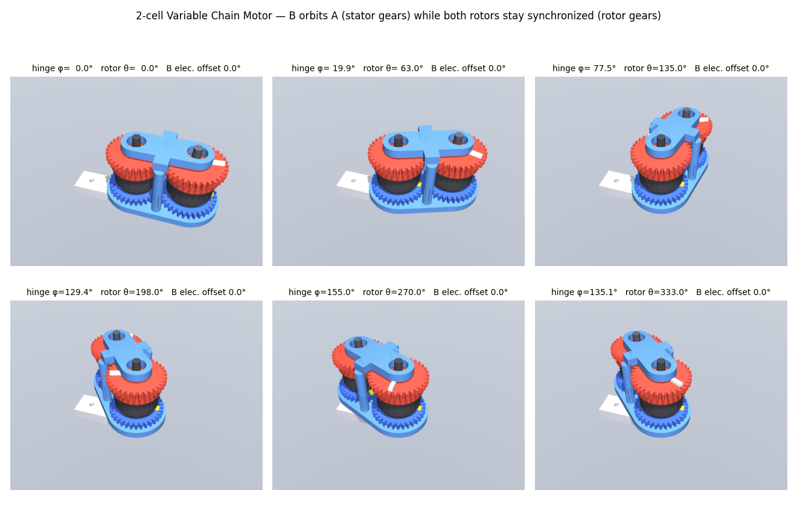
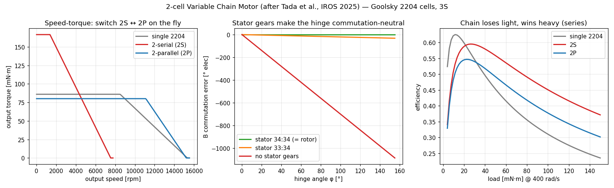

# Chain motor — 2-cell Variable Chain Motor

*After H. Tada, J. Hirai, T. Hiraoka, M. Konishi, T. Himeno, K. Kojima, K. Okada,
"Development of Variable Chain Motor with Shape and Speed-Torque Characteristics
Variability and Its Application to a Humanoid", IROS 2025,
[doi:10.1109/IROS60139.2025.11246199](https://doi.org/10.1109/IROS60139.2025.11246199).*

The smallest chain that can bend: two Goolsky 2204 outrunners (the repo's reference motor)
turned into **motor cells** and run as **one BLDC, from one driver and one encoder**. Cell B
rides a swing link that pivots about cell A's axis, so the motor wraps around a joint instead
of sitting on one side of it.



## How it works

Each cell gets a spur gear on the **rotor** and a spur gear on the **stator**, and the winding's
star point is cut so all six phase ends come out (the paper's Motor Cell). Both gear pairs are
m1 z34 at 1:1, so the link's centre distance is 34 mm.

| Mesh | Does |
|---|---|
| rotor A ↔ rotor B | locks the rotor angles together, so both cells share one encoder and one set of phase currents |
| stator A ↔ stator B | **the hinge trick**: as B orbits A, its stator *and* rotor both turn by the same amount, so B's rotor-to-stator angle (what commutation sees) does not change |

Kinematics in the link frame (hinge φ, output θ):

```
stator B = r_s·φ          rotor B = −r_r·(θ − φ)
B electrical angle = −p·r_r·θ + p·(r_r − r_s)·φ      → φ drops out when r_r = r_s
```

## What the model and sim found

`chain.py` covers kinematics, the electrical configurations and efficiency. `sim.py check`
confirms the claims with MuJoCo dynamics: the gears are equality constraints on the real
joint tree, and each motor torque acts between its own rotor and stator.

- **Validated against the paper.** The same envelope code reproduces the paper's Table III
  (4 × MN5006, 72 V / 30 A) to within 0.2 %.
- **The hinge is torque-neutral** when r_r = r_s. At stall, with the output and hinge both
  held, the hinge servo supplies **0.000 mN·m**. A deliberate 1-tooth ratio mismatch (33:34)
  puts **0.401 mN·m** on the hinge, exactly the virtual-work prediction T_B·(r_r − r_s).
  Without stator gears, 155° of bend is ~1085° of electrical error, and commutation is lost.
- **B must be phase-reversed** (not spelled out in the paper). The external mesh makes B turn
  backwards relative to A, so two of B's leads must be swapped. With the swap, the output gets
  27.28 mN·m (the ideal sum of both cells). Without it, the two cells cancel and the output gets 0.
- **Fast hinge motion loads the output** (the one coupling the static argument misses). Rotor B
  turns 2φ in the world, like a planet on a fixed sun, so swinging the hinge costs the output
  servo **2·I_B·φ̈**. The sim matches this to a fit of 1.00, r = 1.000. It's small for a 2204
  rotor (2.4 mN·m peak for 0→90° in 0.1 s).
- **Backlash** acts across two meshes at the hinge and is multiplied by the 7 pole pairs:
  0.1 mm per mesh gives about 4.7° electrical, costing only 0.3 % of B's torque.

| Configuration (3S, 13 A driver) | Kt (mN·m/A) | Stall (mN·m) | No-load (rpm) |
|---|---|---|---|
| single 2204 | 6.82 | 86 | 15 540 |
| **2-serial** | 13.64 | **167** | 7 770 |
| **2-parallel** | 6.82 | 80 (driver-limited) | 15 540 |



- **Switching point:** switch 2S → 2P above about 4 500 rpm. The paper's MOSFET switch board
  (MCSW) does this mid-motion without stopping. Two cells need one MCSW: 7 switches, where
  S1–S3 give series (one per phase) and S4–S7 give parallel. S1–S6 are pairs of back-to-back
  FETs; S7 is a three-FET, three-terminal switch.
- **Efficiency** at 400 rad/s: the chain loses to a single motor below about 22 mN·m, because
  it pays twice the no-load drag plus the mesh loss. Above that, 2-serial wins. Series always
  beats parallel, because it halves the current through the driver and cable resistance. This
  is the pattern of the paper's Table VI. The efficiency numbers use illustrative loss values,
  not a calibrated dyno.

## CAD (`cad.py`)

6 printed parts (+ 2 reference bodies), each exported as a watertight single body:

| Part | What it is |
|---|---|
| `base` | Fixed to the upper arm; A's stator hub bolts into it |
| `link_lower` | Swing-link lower plate: 6800 bearings on both stator hubs |
| `link_upper` | Swing-link upper plate with fused posts: 685 bearings on both rotor dowels |
| `stator_gear_A` / `stator_gear_B` | Stator gears; A has a long hub that ends in a hex keyed into the base, B a short spinning one. Both hubs are hollow to clear the 3 mm shaft, which exits on the mount side |
| `rotor_gear` (×2) | Rotor cap: gear, a skirt bonded over the bell, and a press hole for a 5 mm steel dowel (`dowel`, reference). A's dowel is the output (encoder magnet on top) |
| `motor_2204` | Reference body only, not printed |

**Fixed after a text-to-cad cross-check (2026-09-25).** Rebuilding these parts with
[earthtojake/text-to-cad](https://github.com/earthtojake/text-to-cad)'s tools found three bugs
that our watertight/single-body checks passed:
- **zero backlash:** the gears sat at exactly one pitch diameter (`closest_points` = 0.000 mm).
  The centre distance now opens by j/(2·tan 20°) for 0.1 mm per mesh, giving 0.048 mm min clearance.
- **0.11 mm walls:** three M2 holes at r = 3.9 broke into the Ø6 bore of A's hub and base
  (`dfam-check` wall thickness). A's hub now ends in a hex that keys into the base (torque) plus
  one central M3 (retention).
- **unprintable rotor cap:** the fused dowel forced 13–22 % support in every orientation. It's now
  a press hole for a steel pin, and the cap prints gear-face-down with 0 % support.

The thinnest remaining wall is the m1 tooth tip at 1.14 mm, just under the 1.2 mm FDM guideline.

**Interference check** (idea borrowed from `earthtojake/text-to-cad`): every pair of placed
solids is intersected at hinge angles of −120, 0, 45, 90 and 155°, and the minimum gap across each
gear mesh is measured. The current design shows **0 mm³** of unexpected overlap. When B's half-tooth phase is deliberately removed, the check
reports **21 mm³** per mesh, so it does catch mis-meshing. It also exercises the 2φ
planet-gear kinematics.

## Caveats

- Bonding the rotor cap over the bell is the weak point: all of B's torque goes through the glue.
- The printed m1 gears are the loss and noise source, and the paper's future work says the same.
- B's six phase leads cross the hinge.
- The hinge itself is unlimited (it can go all the way round); the joint the chain wraps sets the range.

## Run

```
make chain-motor           # model report + out/chain.png
make chain-motor-cad       # parts + design rules + interference check
make chain-motor-check     # MuJoCo dynamic checks
make sim-chain-motor       # viewer: hinge swings 0→155° while the rotors spin
.venv/bin/python chain-motor/sim.py render   # out/sim.gif + montage
```
