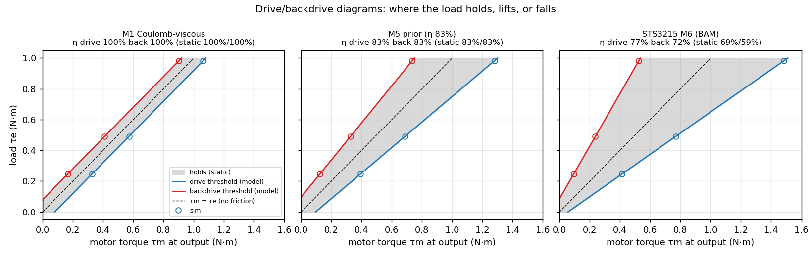

# Friction — extended gearbox friction models for MuJoCo

*After M. Duclusaud, G. Passault, V. Padois, O. Ly, "Extended Friction Models for the
Physics Simulation of Servo Actuators", ICRA 2025 ([arXiv 2410.08650](https://arxiv.org/abs/2410.08650)),
and their library [Rhoban/bam](https://github.com/Rhoban/bam) (Apache-2.0). `params/` is
BAM's pre-fitted library, copied unchanged.*

MuJoCo ships with Coulomb + viscous friction: a constant `frictionloss` and a linear
`damping`. A real gearbox has more friction when it is heavily loaded (load
dependence), different losses when driving versus being backdriven (directional),
and extra friction at rest (Stribeck). These are the effects that decide whether a
joint holds a load, how much current holding costs, and whether it creeps.



## The model

Friction is a torque **budget**. Each step, the applied friction is whatever would stop
the joint, clipped to ±budget. MuJoCo's `dof_frictionloss` already does exactly that clip, so
`mujoco_friction.py` only has to rewrite it every step:

```
budget = Kc + |Km·τm − Ke·τe| + s(θ̇)·[Kcs + |Kms·τm − Kes·τe| + Q]      s = exp(−|θ̇/vs|^α)
```

τm is the ideal motor torque at the output, and τe is the external torque (gravity, loads,
constraints). BAM's M1–M6 are restrictions of this form: M1 is Coulomb, M3 is load-dependent,
M5 is directional, and M6 is quadratic (for harmonic drives). With the Stribeck terms off:

```
η_drive = (1 − Km)/(1 + Ke)      η_back = (1 − Ke)/(1 + Km)      Ke ≥ 1 → self-locking
```

`Friction.from_efficiency(η, drag)` inverts that. The Layer-B efficiency prediction
(`cycloidal/efficiency.py`) becomes an M5 model before anything is built, and Kc is chosen so
the drive curve `η(T) = η∞·T/(T + drag)` is exactly the one the repo already used.

## Checks (`make friction-check`)

- **Matches BAM's own code.** `budget()` equals `bam.Model.compute_frictions` to 1.8e-15
  over 12 000 random states (4 actuators × M1–M6). This was a one-off check against a clone
  of the BAM repo, so it isn't part of the Makefile.
- **The sim obeys the model, at rest.** A MuJoCo pendulum is bisected for the torques where
  a load starts to lift or fall. These match `hold_window()` to within **0.5 % of the load**
  for M1, the M5 prior, and BAM-fitted STS3215 M4/M5/M6 (Stribeck included).
- **The sim obeys the model, moving.** Against a brake with viscous damping, the terminal
  velocity matches the closed form to within 0.0–0.1 %, driving and backdriving.

**Finding: MuJoCo's default friction creeps.** The friction constraint is soft, so inside the
budget the joint still slips at a rate ∝ (1 − solimp). With the default `solimp` (0.9, 0.95),
a 0.25 N·m load held by 0.08 N·m of friction creeps at 8e-3 rad/s (0.5°/s). That is
enough to wipe out the static window entirely: every model looked identical until it was
fixed. `FrictionUpdater` sets `solimp` to (0.999, 0.9999) on its joint, which cuts creep
100× and stays stable with `implicitfast`.

## What BAM's fitted servos say about priors (`make friction`)

| actuator | η drive | η back | η_b/η_f | static drive/back |
|---|---|---|---|---|
| Dynamixel MX-64 | 62 % | 72 % | 1.17 | 50 / 59 % |
| Dynamixel MX-106 | 77 % | 81 % | 1.04 | 54 / 64 % |
| Dynamixel XL330 | 70 % | 73 % | 1.04 | 62 / 61 % |
| Dynamixel XL-320 | 86 % | 84 % | 0.98 | 71 / 60 % |
| Feetech STS3215 | 77 % | 73 % | 0.94 | 69 / 59 % |
| Waveshare ST3025 | 75 % | 80 % | 1.07 | 55 / 69 % |
| eRob80:50 (harmonic) | 97 % | 97 % | 1.00 | 88 / 87 % |
| eRob80:100 (harmonic) | 100 % | 100 % | 1.00 | 80 / 74 % |

- **No backdrive rule of thumb survives.** The single-mesh estimate η_b ≈ 2 − 1/η_f
  predicts backdriving is always worse. That holds for only 2 of these 8. The fitted
  ratio spans 0.94–1.17, so the repo's prior is **symmetric** (η_b = η_f) until a bench
  measures it.
- **Static friction is much larger than moving friction.** At breakaway, the spur servos lose
  another 10–25 points of efficiency. The M5 prior has no Stribeck term, so it
  *under*-predicts holding friction. That's the conservative direction for "will it hold?"
  but the optimistic one for "will it creep smoothly at low speed?"

## Using it

```python
sys.path.insert(0, "friction")
from models import Friction
from mujoco_friction import FrictionUpdater

f  = Friction.from_efficiency(0.83, drag=0.08, kv=0.0015)   # prior from Layer B
f  = Friction.from_bam("sts3215", "m6")[0]                  # or a measured servo
fr = FrictionUpdater(model, "joint_out", f)                 # gear must be the IDEAL Kt·N
fr.prime(data)
data.ctrl[:] = ...; fr.step(data)                           # instead of mj_step
```

`mujoco/run.py` (the hybrid 40:1 bench, `make actuator-bench`) uses the M5 prior. Its Scenario
F shows the change: holding 100 g at 150 mm needs **199 mA** before it backdrives, against
**361 mA** under the old gear = η model (`--m1`).

## Caveats

- **Inertia isn't load.** τe excludes the inertial reaction, as in BAM. During pure
  acceleration with no external load, the friction only sees Km·τm. That's less loss than
  the old gear = η model, and closer to true tooth force only when the load and motor
  inertias are similar.
- **τe lags a step,** because the friction and constraint forces are solved together. BAM makes
  the same approximation. It's fine at MuJoCo timesteps.
- **One hinge or slide per updater.** Ball and free joints aren't supported.
- **Every coefficient for our printed drives is a prior.** Identification (a pendulum bench,
  four trajectory types, and a CMA-ES fit, as in the paper) is the next step.
