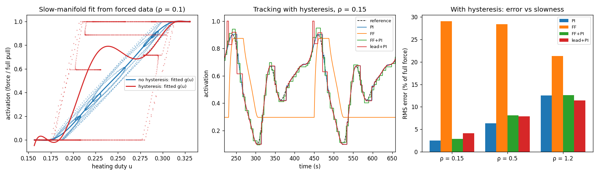
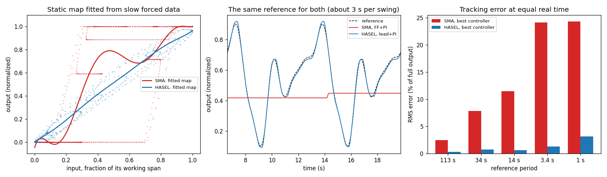

# Matrix muscle

An actuator built from an array of small, dumb contractile cells. Parallel cells add
force, series cells add stroke, and the controller decides which cells fire. The cell
is an SMA wire (Dynalloy Flexinol-90, 150 µm). Everything here is simulation; nothing
has been built.

| file | what |
|---|---|
| `cell.py` | one SMA cell from datasheet numbers: force, stroke, power, wire length |
| `bundle.py` | parallel strands on one tendon: first-order thermal model, pulse / hold / off |
| `sheet.py` | rows × columns with heat conduction between neighbours; fixed vs rotating recruitment |
| `slowmanifold.py` | the control recipe from Bettini et al. 2026, tried on our cell (`make muscle-sm`) |
| `hasel.py` | a HASEL pouch cell (Kellaris model), sized as the same unit (`make muscle-hasel`) |
| `compare.py` | SMA vs HASEL on the same control test (`make muscle-compare`, about 5 minutes) |

Decisions so far:
- **Holding is powered.** There is no latch: cut the current and the cell cools and lets go.
- **Actuate current ≠ hold current.** Overdrive to contract in about 1 s, then drop to a
  hold just above the transition.
- **The controller's job is thermal load-balancing.** Rotating which columns hold cuts the
  worst cell's hot time from 98% to 50%, for 7% more energy and a 15% force dip at each
  handoff (`sheet.py`).

## The paper: Bettini, Kazemipour, Katzschmann & Haller 2026

*Nonlinear spectral modeling and control of soft-robotic muscles from data*, Nature
Communications, [doi 10.1038/s41467-026-77664-0](https://doi.org/10.1038/s41467-026-77664-0)
(ETH Zurich). Read from the main text, methods and supplementary PDF. The data and code
are on Zenodo (10.5281/zenodo.21411485), which refused automated download; not used here.

**Hardware.** An antagonistic elbow. Each side is a HASEL muscle (oil-filled BoPET pouches
with electrodes; up to 8 kV zips the electrodes together and squeezes the oil, so the
pouch shortens), 15 pouches in series, pulling a tendon on a 4 mm moment arm through an
electrostatic clutch. Only one side is engaged at a time.

**Method.**
1. Assume the muscle's own transients are much faster than the commanded motion. Then the
   output is a static function of the input: the "slow manifold".
2. Fit that function as a polynomial from a few recorded trajectories under normal, slowly
   varying input. No step tests: steps excite hysteresis that normal operation doesn't.
   The single actuator needed a straight line (seven trajectories); the joint a 7th-order
   polynomial (three trajectories).
3. Invert it by table lookup for feed-forward, and add a PI loop. It runs at 1 kHz.

They measure "slow enough" with a number ρ: the reference's rate of change over the
plant's decay rate. For a first-order plant and a sinusoidal reference, ρ = ω·τ. The
static map is expected to hold for ρ well below 1.

**Result** on an unseen trajectory at ρ = 0.15:

| controller | RMS error | max error |
|---|---|---|
| PI only | 7.63° | 26.0° |
| feed-forward only | 3.63° | 16.7° |
| feed-forward + PI | 2.38° | 10.4° |

**What they leave open:** driving both sides at once (co-contraction, stiffness control),
rate-dependent and hysteresis-aware corrections, drift, clutch timing. They name SMA as a
candidate for the method "when such time-scale separation is experimentally verified".

### Against our work

| | paper | here |
|---|---|---|
| cell | HASEL: electrostatic, fast, capacitive | SMA: thermal, about 1 s to contract, 2.7 s to cool |
| inputs | one (the sign picks the side) | one per cell, redundant |
| what is learned | a calibration curve | a recruitment schedule (posed, not done) |
| internal state | assumed away | temperature, crosstalk, duty are the problem |
| holding | nearly free | the dominant cost |
| task | position tracking | isometric force and hold |
| evidence | hardware | simulation |

They agree with us that series units add stroke, that a model feed-forward plus light
feedback is the right structure, and that identification should use normal operating data.
They reduce their four inputs to one, so they have nothing to say about choosing which
cells fire.

## The recipe on our SMA cell (`make muscle-sm`)

One strand, isometric, driven by a continuous heating duty. The output is activation
(force over full pull). `HystCell` adds what `bundle.py` leaves out: a hysteresis loop,
as a play operator on temperature. Its half-width (10 °C) is **assumed**; `cell.py` has
only the two end temperatures. The feedback path has 1% sensor noise, 0.1 s delay and a
filter, also assumed. Without them PI wins trivially on a first-order plant.

**1. Slow for an SMA is very slow.** With τ = 2.7 s, the paper's ρ = 0.15 is a reference
period of 113 s. ρ = 1 is 17 s.

**2. The static map does not survive hysteresis.** Open-loop prediction error of the
fitted map, and tracking error (RMS, % of full force), at ρ = 0.15:

| loop half-width | map error | PI | feed-forward | feed-forward + PI |
|---|---|---|---|---|
| 0 °C | 4.2% | 0.19 | 3.1 | 0.24 |
| 2 °C | 8.1% | 0.41 | 9.4 | 0.45 |
| 4 °C | 11.5% | 0.60 | 13.7 | 0.67 |
| 7 °C | 15.4% | 1.28 | 20.9 | 1.31 |
| 10 °C | 19.1% | 2.49 | 29.0 | 2.91 |

The paper's joint map had 8% error. Ours reaches that at a 2 °C loop.

**3. Feed-forward from the map adds nothing to PI here.** With the hysteresis loop it is
never better; with no loop it is within 0.1 points either way.

| ρ | PI | feed-forward | feed-forward + PI | lead + PI |
|---|---|---|---|---|
| 0.15 | 2.49 | 29.0 | 2.91 | 4.11 |
| 0.5 | 6.35 | 28.4 | 8.13 | 7.87 |
| 1.2 | 12.5 | 21.3 | 12.6 | 11.5 |

(10 °C loop. "Lead" adds τ·d/dt of the feed-forward, the rate correction the paper lists
as future work.) The SMA strand is 27 times slower than the assumed feedback delay, so
feedback has time to do the job alone. The HASEL comparison below shows the other case.

**What this means for the matrix.** The result above is for one strand with its own
sensor. The sheet has one tendon sensor for many cells, and the cells get no feedback of
their own. So per-cell behaviour has to come from a model, and this run says a static map
is the wrong model for an SMA cell: its output depends on temperature and on which branch
of the loop it is on. That needs a state per cell (the thermal model we already have,
plus the branch), or a per-cell measurement. Wire resistance is the usual candidate for
SMA; not explored here.

Two things from the paper are still worth keeping:
- ρ as the check for when a static map is valid.
- Forced-response identification: fit from slow operating data, not step tests.

## Option A tried: a HASEL cell (`make muscle-hasel`, `make muscle-compare`)

`hasel.py` models one Peano-HASEL pouch with the quasi-static model the paper uses
(Kellaris et al. 2019; the paper's Eq. 11–12 and Supplementary Eq. 9–12). The closed-form
force matches ½V²·dC/dx computed numerically from the geometry.

**What is sourced and what is assumed.**
- From the paper: BoPET film, 15 pouches in series, up to 8 kV.
- Assumed: every dimension (18 µm film, 20 × 50 mm pouch, electrodes on half) and every
  dynamic number (50 ms time constant, hysteresis as a 2% play on voltage). The paper and
  its supplement give the equations but no parameter values.

**The same 10 N / 10 mm unit, both cells:**

| | SMA | HASEL |
|---|---|---|
| cells | 7 × 5 wires | 2 × 15 pouches |
| active length | 250 mm | 300 mm |
| strain used | 4% | 3.3% (free strain 17.4%) |
| drive | 0.41 A, low voltage | 8 kV, almost no current |
| time constant | 2.7 s (cooling) | 50 ms (assumed) |
| hold power | 11.8 W | about 0 (leakage not modelled) |
| energy per stroke | 11.8 J | 0.39 J at most |

The HASEL's force falls steeply with stroke: 87 N blocked, 7.5 N at a quarter of free
stroke. The unit uses each pouch at a fifth of its free stroke to get 10 N.

**The paper's ordering reproduces on the HASEL cell.** At ρ = 0.15 (tracking RMS error,
% of full output):

| cell | PI | feed-forward | feed-forward + PI | lead + PI |
|---|---|---|---|---|
| SMA | 2.49 | 29.0 | 2.91 | 4.11 |
| HASEL | 4.51 | 5.97 | 3.24 | 1.67 |

On the HASEL, feed-forward + PI beats both alone, as in the paper. The margin is smaller:
PI is 1.4× worse than the combination here, 3.2× in the paper. Their rig has slew limits
and clutch switching that this model doesn't. The lead term wins outright, but it uses the
plant's true time constant, which the simulation knows exactly.

**At equal real time the HASEL is far ahead.** The same reference for both, best controller
for each:

| reference period | SMA | HASEL |
|---|---|---|
| 113 s | 2.5% | 0.3% |
| 34 s | 7.9% | 0.7% |
| 14 s | 11.5% | 0.7% |
| 3.4 s | 24% | 1.3% |
| 1 s | 24% | 3.2% |

At 3.4 s and faster the SMA output does not move at all: the temperature swing stays
inside the hysteresis loop, and 24% is the error of holding still.

**Why feed-forward helps one cell and not the other.** It is the ratio of the plant's time
constant to the feedback delay (ρ = 0.15, PI vs feed-forward + PI):

| case | PI | feed-forward + PI |
|---|---|---|
| HASEL τ 20 ms, delay 100 ms | 14.8 | 5.1 |
| HASEL τ 50 ms, delay 100 ms | 4.5 | 3.2 |
| HASEL τ 200 ms, delay 100 ms | 2.0 | 1.1 |
| HASEL τ 50 ms, delay 10 ms | 1.45 | 1.47 |
| SMA τ 2.7 s, delay 100 ms | 2.5 | 2.9 |

When the plant is faster than the loop can see it, feedback gain has to be low and the
map carries the motion. When the loop is fast relative to the plant, feedback is enough.
So the paper's result is about fast muscles on a slow loop, and the SMA strand is the
opposite case.

**What this does not settle.**
- Every HASEL dynamic number is assumed. The time constant and the delay decide the result,
  as the table shows.
- No dielectric breakdown, leakage, or electrode charging dynamics. 8 kV across two 18 µm
  films is 222 V/µm.
- One unit with a scalar input. Recruitment across a matrix of HASEL cells is not tried.
  Without thermal crosstalk or a holding cost, the reasons we needed rotation go away.

## Other options

Nothing below is built or decided.

**B. Keep SMA, add an electrostatic clutch per tendon.** The paper uses the clutch only to
switch sides. As a hold element it would remove the holding power that drives our whole
architecture, and it reopens the "no static latch" decision. Unknown: the clutch's holding
force at our scale.

**C. Keep SMA as is.** Use PI on tendon force, a state model per cell for recruitment, and
ρ as the validity check. This is the current path with the paper's vocabulary.

A and B change hardware. C costs nothing and is what the SMA code does.
