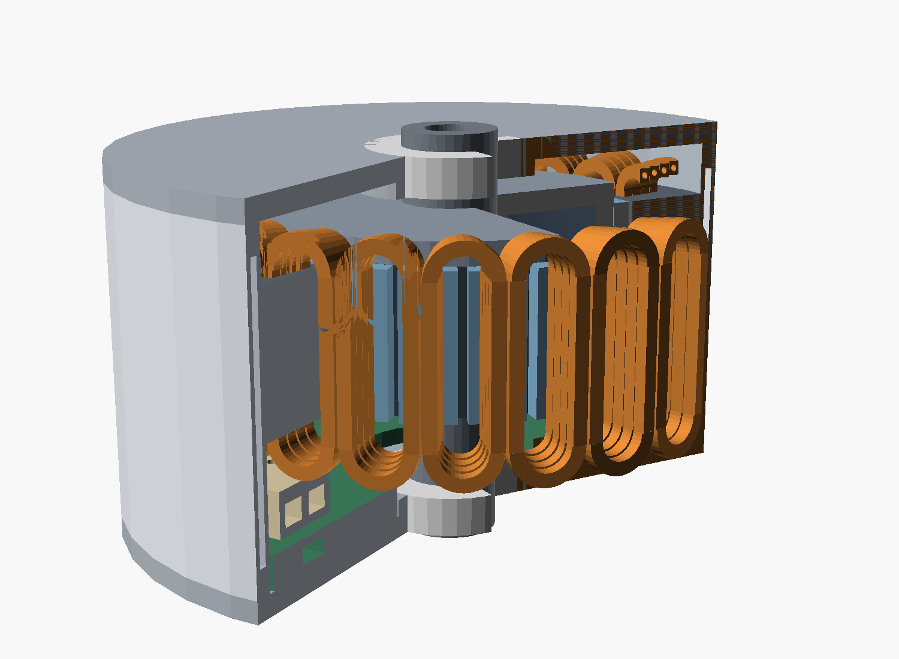
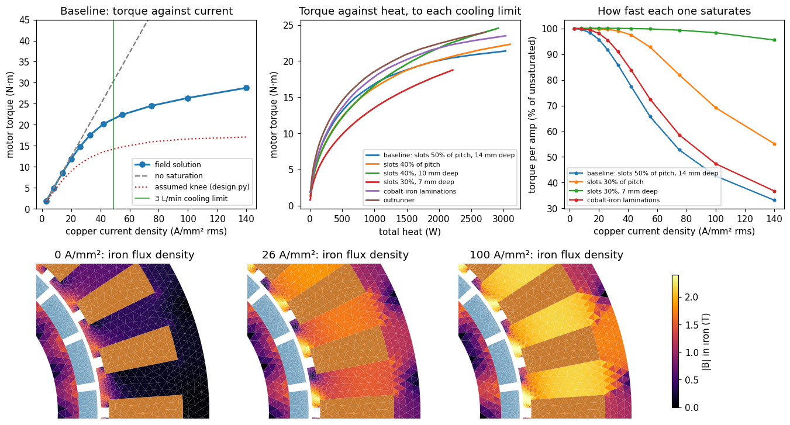
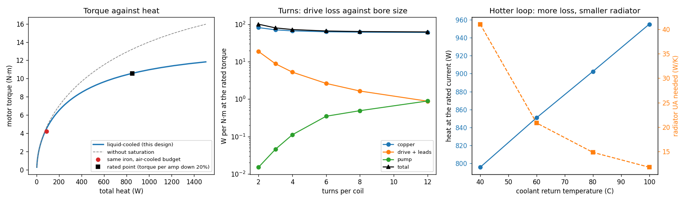

# Liquid-cooled high-current QDD motor

**Thesis under test:** solid-state drives now handle very high current efficiently, so the
limit on a joint motor is heat. Remove the heat actively, run the copper hard, and use less
gear reduction.

| file | what |
|---|---|
| `design.py` | first-order sizing: copper loss, bore hydraulics, coolant, drive (`make qdd-liquid`) |
| `fea.py` | nonlinear 2-D field solution of the same design: torque against current |
| `study.py` | the two together across geometry variants (`make qdd-liquid-fea`, about 5 minutes) |
| `jacket.py` | the same motor with solid conductors and only the jacket (`make qdd-liquid-jacket`) |
| `cad.py` | the shallow-slot design as an assembly: STEP, interference checks, cutaway (`make qdd-liquid-cad`) |

Nothing here has been built.

## The concept

- **Hollow copper conductors.** Coolant flows through the bore of every turn, so the heat
  leaves from inside the copper instead of crossing insulation, iron and a housing.
- **Few turns of large conductor.** A low-voltage, high-current machine.
- **The drive on the motor,** on the same loop.
- **An outer jacket fed with the coldest coolant.** The skin stays near the loop's return
  temperature whatever the copper is doing.
- **Flow order** (regenerative in the rocket-nozzle sense: cold fluid lines the outside
  before it reaches the heat source):

      radiator -> drive cold plate -> outer jacket -> conductor bores -> radiator

- **Coolant:** dielectric oil, so it can touch live copper. Coils are electrically in series
  and hydraulically in parallel with no insulating breaks.

## The design: shallow slots (`design.SHALLOW`, drawn by `cad.py`)

Ø120 mm (RobStride RS04's diameter) × 68 mm, 25 mm stack, 24 slots / 22 poles, stator
outside and pressed into the jacket, Ø64 mm free bore inside the rotor.

| | |
|---|---|
| slots | parallel-sided, 5.8 mm wide × 10 mm deep |
| coil | one per tooth: a single column of 4 turns |
| conductor | hollow rectangular copper, 2.4 × 2.2 mm, Ø1.2 mm bore, 4.1 mm² |
| continuous, 850 W | 16.6 N·m at 132 A rms per phase (32 A/mm²) |
| at that point | copper 793 W, drive and leads 51 W, pump 3 W |
| coolant | oil in at 60 °C, out at 71 °C, 2.6 L/min, 0.28 bar across the coils |
| temperatures | skin 61 °C, copper 126 °C at its hottest, magnets about 90 °C |
| cooling limit (3 L/min) | 21.3 N·m at 43 A/mm², about 1.8 kW |
| torque per amp down 20% | at 67 A/mm² (28.6 N·m): beyond what this pump can cool |
| motor mass | about 1.7 kg (estimate) |

In this design the cooling is the limit again, not the iron: the pump runs out at 43 A/mm²
and torque per amp is still at 92% there.

**The CAD** (`make qdd-liquid-cad`) builds 13 part types from the same `Design` the field
solver uses: stator core, 24 coils, two-piece jacket with its annular channel, rotor yoke,
22 magnets, rotor carrier, manifold ring with supply and return plenums, drive cold plate,
end caps, bearings, shaft. It exports `out/cad/assembly.step` and checks 13 part pairs for
interference. Two things it caught:

- **Coils sharing a slot collided.** A 2.6 mm conductor pitch left 0.2 mm between the two
  coil sides, and their end bends crossed as they left the slot. The pitch is now 2.5 mm,
  0.4 mm apart.
- **The end bends are tight.** Bend radius on the conductor centre is 4.2–5.1 mm for a
  2.4 mm wide hollow conductor. That is under twice its width and needs a forming trial.

Stand-ins in the CAD: each turn is a closed racetrack (no crossovers or leads), the
bearings and shaft are placeholders with no gear stage, and there are no fasteners, seals
or bus bars.

**Conductor layouts compared** (`python qdd-liquid/study.py layouts`), one column per coil
side, as many rows as fit:

| slot | conductor pitch, bore | turns | torque at 850 W | phase current | at the cooling limit |
|---|---|---|---|---|---|
| 10 × 5.8 | 2.6 × 2.3, Ø1.2 | 4 | 16.5 N·m | 132 A | 21.1 N·m |
| 10 × 5.8 | 2.6 × 3.1, Ø1.4 | 3 | 16.1 N·m | 171 A | 19.5 N·m |
| 10 × 4.8 | round Ø2.0 / Ø1.0 capillary | 4 | 12.8 N·m | 98 A | 16.8 N·m |
| 8 × 5.8 | 2.6 × 2.4, Ø1.2 | 3 | 15.4 N·m | 152 A | 18.6 N·m |
| 12 × 5.8 | 2.6 × 2.3, Ø1.2 | 5 | 16.9 N·m | 120 A | 22.4 N·m |
| 10 × 6.6 | 3.0 × 2.3, Ø1.3 | 4 | 16.7 N·m | 141 A | 21.2 N·m |

Round capillary tube is an off-the-shelf part but fills only 39% of the slot and costs a
quarter of the torque. The rectangular conductor is a custom draw.

## The simpler alternative: solid conductors, jacket only (`jacket.py`)

Same iron and slots, the bore filled in (28% more copper), and all the heat leaving through
the tooth to the jacket. A lumped model of that path, with coolant at 60 °C:

| | torque | heat | hottest copper |
|---|---|---|---|
| jacket only, copper at 130 °C | 9.6 N·m | 200 W | 130 °C |
| jacket only, copper at 180 °C | 11.7 N·m | 343 W | 180 °C |
| hollow conductors, 850 W | 16.6 N·m | 849 W | 126 °C |
| hollow conductors, 3 L/min limit | 21.3 N·m | 1775 W | 198 °C |

The jacket alone gets about 70% of the hollow design's 850 W torque, and 55% of its limit,
with ordinary wire and no manifold. It does that at 180 °C copper, where the hollow design
is at 126 °C. Per newton-metre the two make about the same heat.

It works this well here because each coil is a single column: every conductor has a face on
a tooth wall. The largest resistance on the path is the slot liner (40% of the total), so
the result depends on how the coil is seated:

| assumption (copper at 180 °C) | torque |
|---|---|
| as modelled: varnished, 0.3 mm liner at 0.2 W/mK | 11.7 N·m |
| loose coil, 0.05 mm air gap | 9.8 N·m |
| poor press fit to the jacket | 9.7 N·m |
| potted at 1 W/mK | 14.1 N·m |
| potted, turbulent coolant, good fit | 17.1 N·m |

Every thermal number in this model is assumed, and it is lumped, not a thermal field
solution.

## What the field solution found (`study.py`)

`design.py` on its own had to assume where the iron saturates (an air-gap shear of 90 kPa).
`fea.py` solves the field with a real B-H curve instead. The mesh is converged: torque moves
under 1% from 28k to 150k triangles.

The tables in this section are for the first geometry (wedge slots, idealised conductor
fill), which is what the variants were compared on. One solver trap worth recording: with
parallel-sided slots, the slot ends are tangent to the slot-floor and slot-back circles,
which meshes into needle elements and stops Newton converging. `fea.py` leaves those
circles out of the mesh and warns if a solve fails to converge.

**1. Saturation is much gentler than the assumption.**

| current density | torque | torque per amp | assumed knee said | heat |
|---|---|---|---|---|
| 14 A/mm² | 8.5 N·m | 98% | 6.8 | 188 W |
| 26 A/mm² | 14.8 N·m | 92% | 10.7 | 674 W |
| 33 A/mm² | 17.5 N·m | 86% | 12.2 | 1135 W |
| 42 A/mm² | 20.2 N·m | 77% | 13.5 | 2.0 kW |
| 100 A/mm² | 26.4 N·m | 43% | 16.6 | beyond the pump |

The air-gap field is also higher than assumed (1.04 T against 0.83 T), so every torque
figure from `design.py` alone was about 20% low before saturation and more after it.

**2. Heat and saturation arrive together.** Torque per amp is down 20% at 39 A/mm²
(19.3 N·m). A joint-sized pump (3 L/min of oil) runs out at 49 A/mm² (21.4 N·m, about
3 kW). So heat is still a limit, and the iron is the other one, at nearly the same current.

**3. More iron in the same size does not help.** Same Ø120 × 25 mm, copper traded for iron.
Torque in N·m at a given total heat:

| variant | 300 W | 850 W | 1500 W | at the cooling limit | torque per amp down 20% at |
|---|---|---|---|---|---|
| baseline: slots 50% of the pitch, 14 mm deep | 10.5 | 15.9 | 18.8 | 21.4 | 39 A/mm² |
| slots 40% | 9.7 | 15.4 | 18.8 | 22.3 | 57 A/mm² |
| slots 30% | 8.5 | 13.7 | 17.0 | 20.6 | 79 A/mm² |
| slots 10 mm deep (bigger rotor) | 10.5 | 16.7 | 20.7 | 25.0 | 65 A/mm² |
| slots 40%, 10 mm deep | 9.6 | 15.5 | 19.6 | 24.5 | 98 A/mm² |
| slots 30%, 7 mm deep | 7.7 | 12.6 | 16.1 | 18.8 | over 140 A/mm² |
| magnets 5 mm | 10.7 | 16.2 | 19.2 | 22.0 | 40 A/mm² |
| cobalt-iron laminations | 10.8 | 16.8 | 20.2 | 23.5 | 46 A/mm² |
| outrunner | 11.8 | 17.6 | 20.9 | 24.0 | 36 A/mm² |

Wider teeth do push saturation out, a long way. But they take copper away, so the same
torque needs more current density and makes more heat. The two effects cancel: every
variant lands within about 10% of the others at a given heat. The one clear gain is
shallower slots, which let the rotor grow: +5% at 850 W and +17% at the cooling limit, with
a larger free bore (Ø62 mm).

**So the trade is not size for iron; it is size for torque.** At this size, the motor makes
about 16 N·m for 850 W whatever the split between copper and iron. More torque at the same
heat means more stack length (linear) or more diameter (squared).

**4. An outrunner is worth about 11%,** not the 1.5× the first-order model suggested.

**5. What it buys at the joint.** Against RS04 (35 N·m continuous, 120 N·m peak, 9:1, about
88 W to hold rated):

| ratio | continuous output at 850 W | heat to hold 35 N·m | reflected inertia |
|---|---|---|---|
| 9:1 | 138 N·m | 43 W | 1× |
| 6:1 | 92 N·m | 95 W | 0.44× |
| 4:1 | 61 N·m | 218 W | 0.20× |
| 3:1 | 46 N·m | 415 W | 0.11× |
| 2:1 | 31 N·m | 1329 W | 0.05× |

At 3:1 the joint beats RS04's continuous torque with a ninth of the reflected inertia, and
spends about five times the power holding 35 N·m. Direct drive is out of reach at this
size: 20 N·m at the cooling limit. The shallow-slot design is within a few percent of these
figures: 48 N·m continuous at 3:1, and 404 W to hold 35 N·m.

## What the sizing model found (`design.py`)

These hold with the field solution's torque numbers.

**"Very high current" is a choice of turns, not a goal.** What matters is current density.
Fewer turns raise the amps and the drive loss without adding torque: at the same torque,
2 turns per coil means about 280 A and 195 W in the switches and leads, 8 turns means 70 A
and 17 W. More turns shrink the bore, which costs pump pressure. `study.py` picks 8.

**Running the loop hot costs torque and saves radiator.** Copper resistance rises 0.39% per
kelvin and the magnets weaken. Going from a 60 °C to a 100 °C coolant return adds about 12%
heat at the same current and needs a higher magnet grade; the payoff is a radiator a bit
over half the size.

**The cold-first flow order works.** The skin sits within a degree or two of the coolant
return temperature at every operating point.

## Where this leaves the thesis

Mostly intact. Cooling the copper from inside lifts continuous torque from about 5 N·m
(the same iron, air-cooled, 88 W) to 15–21 N·m, and lets the gear ratio drop from 9:1 to
about 3:1. Two corrections:

- Heat is not always the only limit. In the first geometry the iron ran out at nearly the
  same current the pump did; in the shallow-slot design the pump runs out first.
- The price is energy. Torque rises with current and heat with its square, so a low-ratio
  joint holding a load burns several times what a geared one does.

## Not modelled

- 3-D effects: the field solution is 2-D, and a 25 mm stack will lose some torque to end
  leakage.
- Torque ripple (one rotor position), demagnetization, iron loss beyond a rough estimate.
- The B-H curve is a generic electrical-steel fit; cobalt-iron is that curve stretched 15%.
- AC loss, beyond noting the skin depth (about 10 mm) is far larger than the conductor.
- Coil bends, manifolds and fittings in the pressure drop; flow sharing between coils.
- Making it: a custom hollow conductor, its tight end bends, joints, seals and insulation;
  manifold connections and the coil-to-coil electrical links.
- Coolant properties are handbook approximations. Magnet temperature is an estimate.
