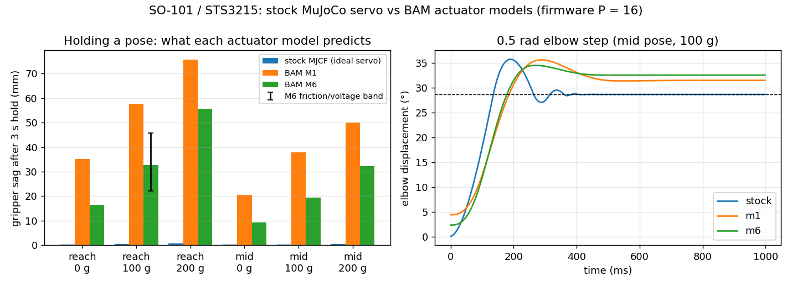

# STS3215 — real2sim for the servo in every punkfab SO-101

The SO-101 MJCF that `software-mfg`, `autobot`, `so101-lab` and `robot-effectors` all load
(TheRobotStudio's upstream model) drives each Feetech STS3215 as an **ideal MuJoCo position
servo**: kp 998 N·m/rad with Coulomb/viscous friction. The real servo is a firmware P loop:
the target is rate-limited, a duty cycle ∝ error, and a DC motor with back-EMF works
through a 1:345 plastic gearbox whose friction depends on load and direction.

This folder swaps in [BAM](https://github.com/Rhoban/bam)'s identified STS3215 model. That's
the same approach Pollen Robotics used for Microduck's sim2real, where "actuator fidelity is
most of the sim2real gap". It also adds the tools to measure *your* servos and correct the
model.



Needs BAM pinned from git (the PyPI 1.0.2 release is stale), plus `colorama`:

```bash
.venv/bin/python -m pip install colorama \
  "better-actuator-models @ git+https://github.com/Rhoban/bam@e9a619d56da5236206f4de6ceec2c1ee1b497b5c"
```

## What changes (`make sts3215-compare`)

All BAM runs use lerobot's firmware **P = 16** (its SO-101 follower lowers the servo's default
of 32) at 7.4 V. Small-error stiffness then works out to about **10 N·m/rad**, against the
MJCF's 998.

| | stock MJCF | BAM M6 |
|---|---|---|
| gripper sag, full reach, no payload | 0.3 mm | **16.5 mm** |
| gripper sag, full reach, 200 g | 0.7 mm | **55.6 mm** |
| same, M6 with friction ×0.7–1.3 and 6.8–8.0 V (100 g) | 0.5 mm | 22–46 mm |
| rest point after approaching from above vs below (100 g) | identical | 4 mm apart |
| 0.5 rad elbow step, final error | 0.03° | 3.9° |
| 3 Hz, ±3° ripple on a slow motion | tracked | mostly lost in friction |

- **History matters.** With 100 g at reach, the rest point is 33 mm low if the load goes onto an
  arm that is already holding still, but 50–54 mm low after moving there. Friction holds
  whatever the motion leaves behind.
- **M1 vs M6.** M1 (Coulomb only) predicts about twice M6's sag. Load-dependent static
  friction carries part of the load, so the model tier matters as well as switching to BAM.
- **Creep.** With MuJoCo's default soft friction, a held arm keeps sagging (+4.6 mm over 7 s at
  reach with 200 g). `StsServos` stiffens `solimp` (see `../friction/README.md`), which cuts
  that to +0.3 mm.

## What it does to punkfab's own gates (`make sts3215-crosscheck`)

`software-mfg/scripts/workcell_check.py` drives the arm 60 mm above the work datum and passes
within 20 mm. With BAM M6 it **still passes**, at 4–6 mm (0–300 g, across the whole
randomized band), against stock's 0.4 mm. That gate is loose enough. Any claim tighter than
about 5 mm near that pose isn't supported by the stock sim: insertion, peg-in-hole, fixture
seating, or "the tool arrives at the datum". Re-check those with `bamify()` + `StsServos`.
`crosscheck.py` shows the pattern without editing software-mfg.

The arrival error depends on the path. This gate starts from the zero pose and arrives from
above, so friction helps it hold. A different approach gives a different error.

## Closing the loop on your arm

BAM's M6 was fitted to Rhoban's servos on a pendulum. Yours differ, so measure them:

```bash
# 1. record (MOVES THE ARM; run from so101-lab's venv, which has lerobot + the Feetech SDK)
cd ~/sandbox/dnewcome/so101-lab
uv run python ~/sandbox/punkfab/robot-actuators/sts3215/record.py --check      # pose/voltage sanity
uv run python ~/sandbox/punkfab/robot-actuators/sts3215/record.py --joint elbow_flex --traj all
uv run python ~/sandbox/punkfab/robot-actuators/sts3215/record.py --joint shoulder_lift --traj all --payload-g 100

# 2. score the models against the logs, then fit the corrections
cd ~/sandbox/punkfab/robot-actuators
.venv/bin/python sts3215/replay.py ~/so101_logs/*.npz      # MAE per model + out/replay.png
.venv/bin/python sts3215/fit.py ~/so101_logs/*.npz         # -> out/fit.json
```

- **`record.py`** moves one joint at a time through BAM-style trajectories (chirp 0.3→2 Hz,
  slow raise/lower, ±5/10/20° steps, slow + fast ripple) around a mid pose. Every write goes
  through lerobot's `max_relative_target` clamp. It logs goal and position for all joints,
  plus current, load and supply voltage for the moving joint, at 100 Hz. It leaves out the
  paper's torque-off drop, because on an arm the link would fall.
- **`replay.py`** plays the logged goals in MuJoCo (zero-order hold, measured supply voltage)
  for stock, M1 and M6, and scores the moving joint's mean absolute error (BAM's metric).
- **`fit.py`** fits three multipliers on M6: friction, P-gain path and armature. It uses
  Nelder–Mead with the last log held out. Pass the result to `Arm("m6", **fit)` or
  `StsServos(..., **fit)`.

**The pipeline is verified on synthetic logs** (`make sts3215-synthetic`). I made stand-in
"real" logs from M6 with friction ×1.4, gain ×0.85 and 4096-count encoder quantization.
Replay ranks the models stock 5.19° > M1 1.88° > M6 1.36° MAE. The fit then recovers
friction ×1.404, gain ×0.851 and armature ×1.003, and held-out error drops 1.10° → 0.02°
(the quantization floor).

**Not yet run on hardware.** No arm was attached when this was written. `record.py` uses
lerobot's documented `SOFollower` API and register names, but it hasn't been run, so start
with `--check`.

## Using it elsewhere

```python
sys.path.insert(0, "~/sandbox/punkfab/robot-actuators/sts3215")
from arm import bamify, StsServos, JOINTS

bamify(spec, JOINTS)                         # position actuators -> torque motors
m = spec.compile(); d = mujoco.MjData(m)
servos = StsServos(m, d, JOINTS, "m6")       # + **fit.json corrections, vin=..., kp=...
servos.set("elbow_flex", 0.6)
servos.update(); mujoco.mj_step(m, d)        # update() before every step
```

## Caveats

- **Only the 7.4 V, 1:345 servo is identified.** That's the standard follower. The 12 V
  STS3215 and the leader arm's 1:147/1:191 servos need their own logs.
- **No backlash yet.** Microduck adds a passive hinge in series with each servo, and the
  firmware reads its encoder *through* that play. The upstream MJCF defines a `backlash`
  class (±0.5°) that no joint uses.
- **Joint mapping.** `record.py` assumes lerobot degrees equal the MJCF's new-calibration
  angles, as so101-lab's sim backend does. Check a pose with `--check` first.
- **Speed.** BAM's per-step Python controller costs about 3× a plain `mj_step` here, which is
  fine for gates and far too slow for RL. For RL, use `bam.mjlab`, which Microduck uses.
